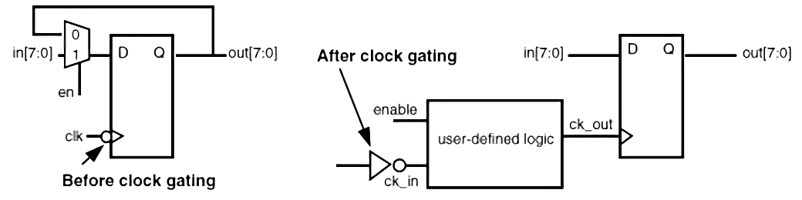

# Samsung Projects

| Project | Details |
| :---:   | :---:   |
| Text Detection | |
| Texture Creation | |
| Inverse Tone Mapping |  |
| Motion Estimation |  |
| Local Contrast Enhancement | |
| Asynchronous FIFO | |
| Neural Processing Unit | |
| Contrast Enhancement | |
| Hybrid Deep Learning Super Scalar | |
| Deep Learning Super Scalar | |
| Mode Decision | |
| Bilateral Filter |  |
| DLSR with MAC Architecture | |
| DLSR with Winograd Architecture | |
| WGMA/DCARN/MLSR : Power Optimization |  |
| Python/Bash scripting | |
| DL0, Post Processing, NPU | |

---

# Internship

* Tencom Intellectual Ventures

---

# Undergraduate Thesis

* M.Tech Thesis: Decode & Forward based Path Selection Scheme in MultiHop WirelessNetworks

---

# Academic Projects

* Sticky Notes (Software Lab)
* Scientific Calculator (Software Lab)
* Search Engine Indexing (Data Structures)
* Cricket Player Information App (Software Lab)
* Software Suite for Student Management in C++ using OOP (Software Lab)
* Android Controlled Wireless Bluetooth Robot Car (Design Lab)
* Sports/Fitness Digital Assistant (Mini Project)
* Development of Speaker Recognition System (Multimedia Systems)
* Moving Text Message Display on GLCD (Embedded Systems)
* GCD processor implementation on FPGA board (Computer Architecture)
* Interfacing of a Real Time Clock Chip (Embedded Systems)
* Audio Playback with Modulation (Embedded Systems)
* Filtering on DSP Starter Kit (Digital Signal Processing)
* Panorama Stitching (Digital Image Processing)
* Contour Tracing (Digital Image Processing)
* Image Filtering (Digital Image Processing)

---

# Hardware Design Specific Courses

* NPTEL: Hardware Modeling Using Verilog
* NPTEL: VLSI Physical Design
* NPTEL: Digital Circuits and Systems

---

# Courses Done

* Introduction to Computer Science
* Data Structures
* Software Lab
* Probability and StochasticProcesses
* Computer Networks
* Operating Systems
* Computer Architecture
* Multimedia Systems
* Mobile Computing
* Selected Topics in Communication Engineering-I
* Digital Communication andInformation Systems
* Signal Theory
* Signals and Systems
* Digital Electronics
* CommunicationEngineering
* Digital Signal Processing
* Digital Communications
* Digital Hardware Design
* Em-bedded Systems
* Microprocessor Based Industrial Control
* Digital Image Processing
* SelectedTopics in Communication Engineering-II
